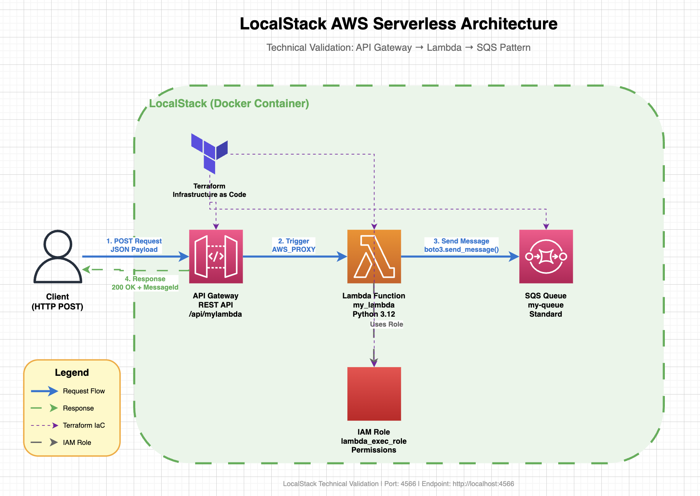

# LocalStack Technical Validation Project

> **Technical Validation**: Exploring LocalStack for local AWS development and testing

[](https://localstack.cloud/)
[](https://www.terraform.io/)
[](https://aws.amazon.com/)
[](https://www.python.org/)

## 🎯 Project Purpose

This project serves as a **technical validation** and **exploration** of [LocalStack](https://localstack.cloud/) - a fully functional local AWS cloud stack. The goal is to evaluate LocalStack's capabilities for local development and testing of AWS serverless architectures without incurring cloud costs.

## 📊 Architecture



### Pattern: API Gateway → Lambda → SQS

This proof-of-concept implements a common serverless event-driven pattern:

```
HTTP Request → API Gateway → Lambda Function → SQS Queue
```

**AWS Services Validated:**
- ✅ Amazon API Gateway (REST API)
- ✅ AWS Lambda (Python 3.12)
- ✅ Amazon SQS (Simple Queue Service)
- ✅ AWS IAM (Roles & Policies)

## 🚀 Quick Start

### Prerequisites

```bash
# Required software
- Docker Desktop >= 20.10
- Terraform >= 1.0
- AWS CLI >= 2.0
- Python >= 3.8
```

### Setup in 5 Minutes

```bash
# 1. Start LocalStack
docker-compose up -d

# 2. Package Lambda function
pip install -r requirements.txt -t ./package
cp main.py ./package/
cd package && zip -r my_lambda.zip . && cd ..

# 3. Deploy infrastructure (best practice)
terraform init
terraform plan -out=tfplan -detailed-exitcode
terraform apply "tfplan"

# 4. Test the API
API_URL=$(terraform output -raw invoke_url_localstack)
curl -X POST "$API_URL" \
  -H "Content-Type: application/json" \
  -d '{"test":"validation","timestamp":"2026-05-01T09:00:00Z"}'

# 5. Verify message in SQS
# Note: If you get "Error when retrieving token from sso: Token has expired"
# Set these environment variables first:
export AWS_ACCESS_KEY_ID="test"
export AWS_SECRET_ACCESS_KEY="test"
export AWS_DEFAULT_REGION="us-east-1"

aws --endpoint-url=http://localhost:4566 sqs receive-message \
  --queue-url http://localhost:4566/000000000000/my-queue

# Or use inline credentials:
AWS_ACCESS_KEY_ID=test AWS_SECRET_ACCESS_KEY=test \
  aws --endpoint-url=http://localhost:4566 sqs receive-message \
  --queue-url http://localhost:4566/000000000000/my-queue
```

> **💡 Tip**: If you encounter AWS SSO token errors, see the [AWS CLI Credential Issues](docs/06-TROUBLESHOOTING.md#-aws-cli-credential-issues) section in the troubleshooting guide.

## 📁 Project Structure

```
localstack/
├── README.md                           # This file - Project overview
├── .gitignore                          # Git exclusions
│
├── docs/                               # Documentation
│   ├── 01-GETTING-STARTED.md          # Setup and installation
│   ├── 02-ARCHITECTURE.md             # Architecture details
│   ├── 03-DEPLOYMENT.md               # Deployment guide
│   ├── 04-TESTING.md                  # Testing procedures
│   ├── 05-CONFIGURATION.md            # Configuration reference
│   ├── 06-TROUBLESHOOTING.md          # Common issues and solutions
│   ├── 07-VALIDATION-RESULTS.md       # Technical validation findings
│   └── images/                        # Diagrams and images
│       ├── architecture.png           # Architecture diagram
│       └── architecture-diagram.drawio # Editable diagram
│
├── main.tf                             # Terraform infrastructure
├── main.py                             # Lambda function source
├── docker-compose.yaml                 # LocalStack configuration
├── requirements.txt                    # Python dependencies
│
├── package/                            # Lambda deployment (generated)
└── volume/                             # LocalStack data (generated)
```

## 📚 Documentation

| Document | Description |
|----------|-------------|
| **[Getting Started](docs/01-GETTING-STARTED.md)** | Prerequisites, installation, and initial setup |
| **[Architecture](docs/02-ARCHITECTURE.md)** | Detailed architecture and component descriptions |
| **[Deployment Guide](docs/03-DEPLOYMENT.md)** | Step-by-step deployment instructions |
| **[Testing Guide](docs/04-TESTING.md)** | Testing procedures and examples |
| **[Configuration](docs/05-CONFIGURATION.md)** | Configuration options and environment variables |
| **[Troubleshooting](docs/06-TROUBLESHOOTING.md)** | Common issues and solutions |
| **[Validation Results](docs/07-VALIDATION-RESULTS.md)** | Technical validation findings and recommendations |

## 🧪 Validation Results Summary

### ✅ What Works Well

| Aspect | Rating | Notes |
|--------|--------|-------|
| **Infrastructure as Code** | ⭐⭐⭐⭐⭐ | Terraform works seamlessly |
| **API Gateway** | ⭐⭐⭐⭐⭐ | Full functionality validated |
| **Lambda Functions** | ⭐⭐⭐⭐⭐ | Python runtime works perfectly |
| **SQS Integration** | ⭐⭐⭐⭐⭐ | Message handling as expected |
| **Developer Experience** | ⭐⭐⭐⭐☆ | Minor URL format differences |

### 📈 Key Metrics

- **Setup Time**: ~10 minutes
- **Deployment Speed**: ~30 seconds
- **Cost**: $0 (vs AWS charges)
- **AWS Parity**: ~85% for tested services
- **Recommendation**: ✅ **APPROVED for Development Use**

## 💡 Key Learnings

### Benefits
✅ **Zero AWS costs** during development  
✅ **Instant deployment** and testing  
✅ **Isolated environment** - no production impact  
✅ **Reproducible** local setup  
✅ **Offline development** capability  

### Considerations
⚠️ **URL format differences** from AWS  
⚠️ **Not 100% AWS parity** - some behavioral differences  
⚠️ **Still need AWS integration testing** before production  
⚠️ **Limited service coverage** - not all AWS services supported  

## 🎓 Use Cases

### ✅ Ideal For:
- Local development and testing
- CI/CD pipeline testing
- Learning AWS services
- Proof-of-concept development
- Integration testing
- Cost-conscious development

### ❌ Not Ideal For:
- Production workloads
- Performance testing
- Security validation
- Complete AWS feature parity
- Multi-region testing

## 🔄 Next Steps

### Recommended Validations
- [ ] Test S3 integration
- [ ] Validate DynamoDB operations
- [ ] Test SNS notifications
- [ ] Validate Step Functions
- [ ] CI/CD integration
- [ ] Performance benchmarking

## 🔗 Resources

- **[LocalStack Documentation](https://docs.localstack.cloud/)**
- **[Terraform AWS Provider](https://registry.terraform.io/providers/hashicorp/aws/latest/docs)**
- **[Original Tutorial](https://www.youtube.com/watch?v=XPFl28a0mrQ&t=23s)**
- **[LocalStack Community](https://discuss.localstack.cloud/)**

## 🤝 Contributing

To extend this validation:

1. Fork the repository
2. Add new service tests
3. Document findings in `docs/07-VALIDATION-RESULTS.md`
4. Submit pull request

## 📝 License

This project is for educational and technical validation purposes.

---

**Project Status**: ✅ Technical Validation Complete  
**Last Updated**: 2026-05-01  
**Recommendation**: Approved for Development & Testing Environments

For detailed documentation, see the [docs](docs/) folder.